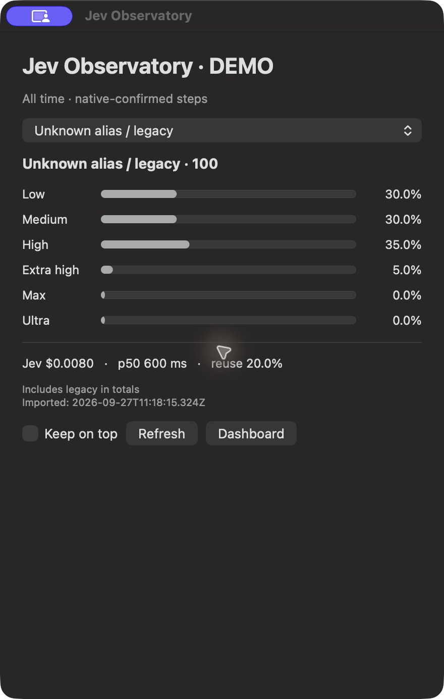

# Jev Observatory (optional macOS companion)

Inspect Jev decisions without reading JSONL: a native floating window, Dock and menu-bar access, plus a local browser dashboard. This companion is independent of Codex desktop integration PR #7 and works with ordinary CLI logs. No Economy model or policy is installed.

## Install

Requires macOS 13+, Xcode Command Line Tools (`swiftc`, `codesign`), and Node 24+. From a source checkout:

```sh
cd companions/observatory
npm ci
node install.mjs install
open "$HOME/Applications/Ares Observatory.app"
```

Pass `--login` to install a per-user RunAtLoad LaunchAgent for the next login. Installation does not load the agent immediately; open the app for the current session. Existing apps or launch files are never overwritten. The build is ad-hoc signed, not notarized. The bundle includes built web assets, collector source, and its npm dependencies; no running checkout/dev server is required. The launcher uses the Node executable found during installation. Reinstall after removing/moving that Node installation.

Quit the application before uninstalling:

```sh
node install.mjs uninstall
```

Uninstall checks ownership, removes only the app and unchanged login entry, and leaves all logs and metrics intact. It does not modify CODEX_HOME, CODEX_CLI_PATH, Codex config, or other LaunchAgents. Closing the window keeps the app running; Quit also stops its collector. Reopen from the Dock or Command-0. Keep on top and window position persist.

## How it works

Existing `~/.local/share/astra-ares/runs/*/decisions.jsonl` files feed an incremental collector every 30 seconds. Optional matching Codex session counters come from `~/.codex/sessions`. SQLite stores metadata at `~/.local/share/astra-ares-observatory/metrics.sqlite`. The native app polls the same loopback API as the dashboard at `http://127.0.0.1:4319`. No provider credentials or remote connection is needed. Custom source paths: `OBSERVATORY_RUNS`, `OBSERVATORY_SESSIONS`, `OBSERVATORY_DB`; custom port: `OBSERVATORY_PORT` (set for both app and collector). Environment overrides are intended for CLI launches/testing, not persisted by the installer.

The dashboard provides alias/date/repository filters, fresh versus applied distributions, daily charts, decision probabilities, chat review notes, token counters, error counts, and JSON export. The native window shows one selected alias, aggregate cost/latency/reuse, refresh, and Dashboard. Source aliases absent from upstream logs remain unknown; optional private Standard/Economy aliases are recognized only if explicitly logged. Missing Economy data displays an empty state.

## Interpretation and privacy

- Only decisions with `native_step_context_captured` count as applied. Fresh excludes lease reuse. Costs/latency use fresh confirmed decisions, not every attempted request or an invoice reconciliation.
- Jev cost is separate from Astra consumption. Choice probabilities are evaluator outputs, not calibrated quality guarantees.
- Token counters are positive cumulative deltas matched by exact chat/turn IDs. The first snapshot and counter resets are excluded. Missing sessions remain unmatched. Whole mixed-profile turns may overlap across separate filtered reports. No per-effort token attribution is claimed.
- Legacy aliases stay separate. Extra-high frequency does not prove policy compliance. No causal savings claim or controlled benchmark is included.
- Raw prompts, completions, tool output, credentials, and raw error messages are not copied. Local IDs, repository paths, metrics, and manual review notes are retained; exported reports may contain these identifiers.
- All original logs remain untouched. Metrics are retained indefinitely. Import resumes from complete-line byte offsets; incomplete trailing records wait for the next import. SQLite size excludes WAL/SHM overhead.
- The ledger/export is limited to the latest 2,000 matching decisions; aggregates cover all matches. Error history is global. Use a fixed-effort control and comparable tasks before judging savings.
- Loopback only. Do not expose the unauthenticated local service to a network. No automatic port fallback; port 4319 must be available. Native stale/offline status retains the last snapshot rather than replacing it with zeros.

## Verify

```sh
npm test
npm run build
swiftc MenuBar.swift -o /tmp/Observatory-check -framework Cocoa
```

Code is covered by the repository MIT license. React, React DOM, Express, Vite, Recharts, and lucide-react retain their package licenses in bundled node_modules; Node and Apple frameworks are supplied separately. Dependency versions are locked. CLI users incur no additional dependencies unless they install this companion.



The screenshot is an actual native window using synthetic metadata generated by `demo.mjs`, explicitly labeled DEMO. It is not runtime proof of savings or a real provider request.
